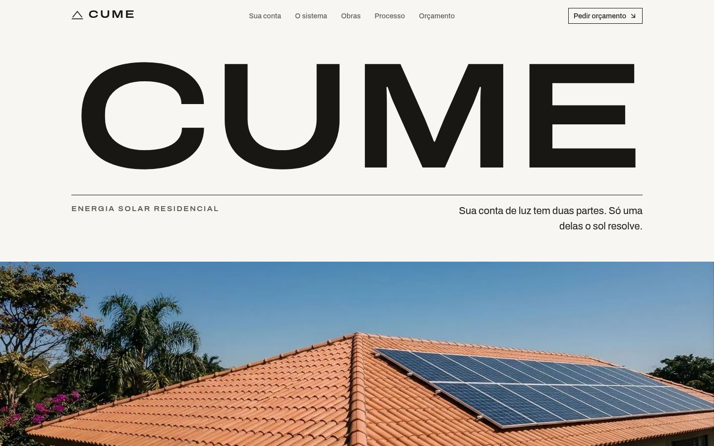

<div align="center">

# Cume

### Energia solar residencial

_Landing page de uma empresa de energia solar residencial com uma calculadora que divide a conta de luz em duas partes antes de pedir qualquer dado, com conversão por pedido de orçamento_

#### [Link da demo](https://cume-solar.vercel.app/)

---

[](https://nextjs.org/)
[](https://react.dev/)
[](https://www.typescriptlang.org/)
[](https://tailwindcss.com/)

</div>

---



## ✨ Sobre o Projeto

**Cume** é a landing page de uma empresa fictícia que projeta e instala sistemas fotovoltaicos em casas no Brasil. O nome vem da cumeeira, a linha mais alta do telhado.

O setor vende economia: "economize até 95%". A página parte do contrário. A conta de luz tem duas partes, e só uma delas o sol resolve. Um slider recebe o valor da conta, e a página mostra quanto um sistema cobriria, quanto continua chegando todo mês, quantos módulos seriam necessários e quanto um sistema desse tamanho custa hoje. Cada número vem com a premissa ao lado. Essa estimativa segue com o visitante até o formulário de orçamento.

Site estático, em português, sem back-end e sem coleta de dados.

## 🛠️ Stack

Next.js 16 · React 19 · TypeScript · Tailwind CSS 4 · shadcn/ui (Base UI) · next-intl · Motion · Archivo

## 🎯 Destaques técnicos

- **Calculadora**: um único slider. O tipo de ligação (monofásica, bifásica ou trifásica) é deduzido do valor da conta, escrito em português simples e pode ser corrigido pelo visitante. O custo de disponibilidade, a tarifa média, a produtividade por kWp e o preço de mercado por Wp estão em `src/content/data.ts`, com a data em que foram conferidos.
- **Estado compartilhado**: a estimativa vive num store externo (`useSyncExternalStore`), e o resumo travado do formulário mostra os mesmos números que a calculadora, sem que uma seção dependa da outra.
- **Acessibilidade**: o slider anuncia o valor em reais, e o resultado é lido ao soltar o controle. Tabelas com cabeçalhos de linha e de coluna, foco visível em todos os controles, navegação completa por teclado e alvos de toque de pelo menos 24px. As premissas ficam num `<details>` nativo, que abre mesmo sem JavaScript.
- **Performance**: Lighthouse mobile em build de produção, com **100** em Acessibilidade, Boas práticas e SEO e CLS zero. Performance **86–87** com throttling simulado e **99** com throttling real: o maior elemento da tela é o próprio wordmark, que já aparece no primeiro quadro. Imagens em WebP com placeholder borrado.
- **Movimento**: a divisão da conta cresce a partir de uma base comum, os números contam na primeira entrada e depois acompanham o slider, e as linhas das tabelas entram em cascata. Tudo respeita `prefers-reduced-motion`.
- **SEO**: metadata, OpenGraph e JSON-LD, com a imagem social montada a partir da foto do hero.
- **Sem rastreamento**: nenhum analytics e nenhum cookie. O formulário é simulado no navegador e nada é enviado.
- **Segurança**: Content-Security-Policy e os demais headers configurados.

## 📐 Design

A página se parece com um desenho técnico, e não com um anúncio. Na margem esquerda de cada seção, um rótulo diz a unidade que a seção mede: `CONSUMO. R$/MÊS`, `SISTEMA. kWp`, `PROCESSO. DIAS ÚTEIS`. As tabelas têm filetes finos, e os números ficam grandes e alinhados à direita. Quem compara orçamentos de energia solar já lê tabelas de especificação, e esta página é uma delas.

Uma família só, Archivo, com o eixo de largura fazendo o papel de uma segunda fonte: letra larga é sempre a marca ou uma medida. A paleta é acromática, com um único azul tirado do céu da foto do hero, que aparece só onde a página responde ao visitante.

Detalhes em **[DESIGN.md](DESIGN.md)**.

A direção visual partiu de páginas de estúdios de arquitetura e de mobiliário, entre elas as da **Sirotov Architects** e da **NORDURE**.

## 📄 Seções

- **Hero**: o wordmark de ponta a ponta e o telhado ao meio-dia
- **Calculadora**: a conta dividida em duas partes, com módulos, área, faixa de preço e premissas
- **O sistema**: as peças fotografadas e anotadas, e a tabela que toda proposta deve trazer
- **Obras**: as entregas mais recentes, uma por estado
- **Processo**: da visita à homologação, com o prazo de cada etapa num eixo comum
- **Orçamento**: o resumo da estimativa ao lado do formulário, e a mesma casa ao anoitecer

## 🏗️ Arquitetura

```
src/
├── app/[locale]/          # Rotas
│   ├── layout.tsx         # Layout root + metadata
│   ├── page.tsx           # Página principal
│   ├── privacy/           # Política de privacidade
│   ├── opengraph-image.tsx
│   └── not-found.tsx
├── components/
│   ├── sections/          # As seções, a calculadora e o store da estimativa
│   ├── layout/            # Header, footer e menu
│   ├── conversion/        # CTA e formulário de orçamento
│   ├── brand/             # Símbolo e wordmark
│   ├── media/             # Wrapper das imagens
│   ├── motion/            # Primitivas de animação
│   ├── seo/               # JSON-LD
│   └── ui/                # shadcn/ui components
├── content/               # Premissas, dados e manifesto de imagens
├── config/                # Fontes e configuração do site
├── i18n/                  # Configuração next-intl
├── hooks/                 # Hooks compartilhados
├── lib/                   # Utilitários
└── assets/images/         # Imagens locais
```

## 🚀 Getting Started

### Pré-requisitos

- Node.js 20+
- pnpm

### Instalação

```bash
# Clone o repositório
git clone https://github.com/gustavoppdev/cume-solar.git

# Entre no diretório
cd cume-solar

# Instale as dependências
pnpm install
```

### Desenvolvimento

```bash
# Inicie o servidor de desenvolvimento
pnpm dev
```

Abra [http://localhost:3000](http://localhost:3000) no navegador.

### Scripts

| Script | Faz |
|---|---|
| `pnpm build` | Build de produção |
| `pnpm lint` | ESLint |
| `pnpm typecheck` | Checagem de tipos |
| `pnpm check:contract` | Verifica tokens, mensagens e estilos |

## ⚠️ Aviso

A Cume, suas obras e seus prazos são fictícios. Nenhum serviço é oferecido e nenhum dado é coletado. As premissas da calculadora vêm de fontes públicas de setembro de 2026 e envelhecem: o resultado é uma estimativa, não uma proposta. As imagens foram geradas por IA.

---

## 👨‍💻 Autor

**Gustavo Henrique**

Desenvolvedor Front-end especializado em React, Next.js e arquiteturas modernas. Este projeto demonstra habilidades em:

- Interação com estado compartilhado entre seções
- Acessibilidade WCAG 2.2 AA verificada
- Performance e otimização de imagens
- Design systems e componentização
- Type safety e qualidade de código
- Animação com respeito a `prefers-reduced-motion`

---

<div align="center">

**[⬆ Voltar ao topo](#cume)**

Feito com ❤️ e TypeScript

</div>
